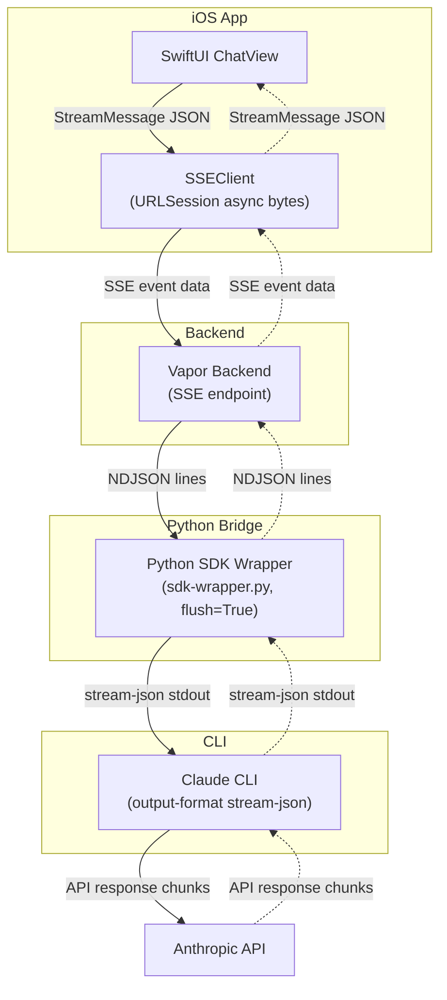
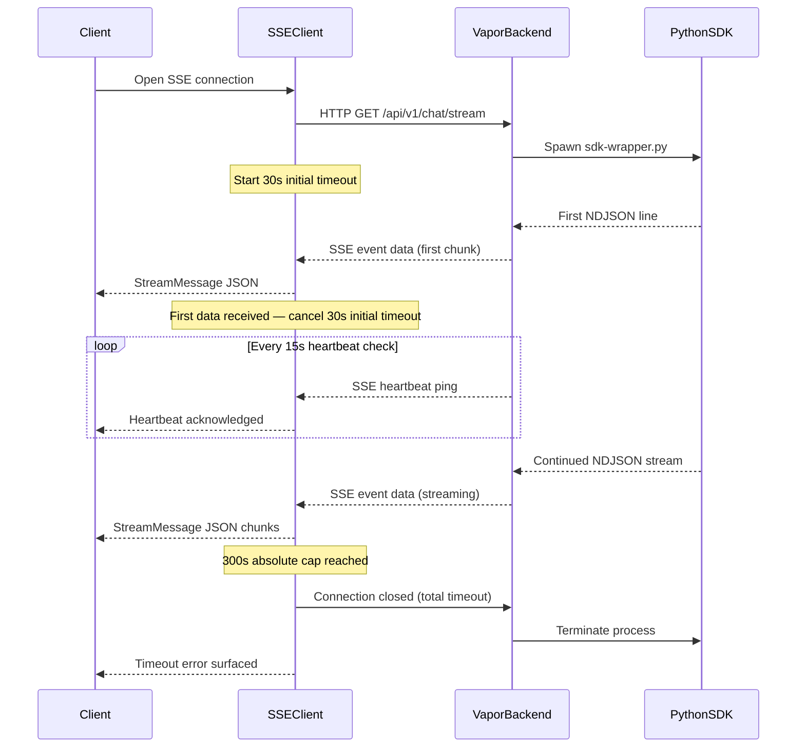

## The 5-Layer SSE Bridge: Building a Native iOS Client for Claude Code

*Agentic Development: 10 Lessons from 8,481 AI Coding Sessions*

Every token Claude generates on your behalf traverses five layers before it appears on your iPhone screen. SwiftUI view. Vapor backend. Python SDK wrapper. Claude CLI. Anthropic API. Then the whole chain reverses: API response, CLI stdout, Python NDJSON, Vapor SSE, URLSession async bytes, SwiftUI `@Observable`.

Ten hops per token. Each one a place where the stream can break, stall, duplicate, or silently disappear.

This is the story of building ILS, a native iOS and macOS client for Claude Code. Not a web wrapper. Not a thin API client. A full SwiftUI application that streams Claude's responses token-by-token over Server-Sent Events, with reconnection logic, heartbeat monitoring, environment variable stripping, and a two-character bug that took an entire session to find.

The companion repo extracts the streaming bridge as a standalone Swift package you can drop into any project.

---

### The Architecture



- **Layer 1:** SwiftUI `ChatView` observes an `@Observable` `SSEClient`.
- **Layer 2:** `SSEClient` opens a POST to the Vapor backend's `/api/v1/chat/stream` endpoint.
- **Layer 3:** Vapor spawns `python3 sdk-wrapper.py`, which calls the `claude-agent-sdk`.
- **Layer 4:** The SDK wraps Claude CLI with `--output-format stream-json`.
- **Layer 5:** Claude CLI calls the Anthropic API.

Responses flow back up the same chain. Each layer adds its own failure modes.

---

### Layer 1: The Bridge Configuration

Everything starts with a configuration struct that controls timeouts, reconnection, and network behavior:

```swift
// Sources/StreamingBridge/Configuration.swift

public struct BridgeConfiguration: Sendable {
    public let backendURL: String
    public let initialTimeout: TimeInterval
    public let totalTimeout: TimeInterval
    public let heartbeatTimeout: TimeInterval
    public let maxReconnectAttempts: Int
    public let reconnectBaseDelay: TimeInterval
    public let allowsExpensiveNetworkAccess: Bool
    public let allowsConstrainedNetworkAccess: Bool
    public let streamEndpoint: String
    public let sdkWrapperPath: String

    public static let `default` = BridgeConfiguration()

    public init(
        backendURL: String = "http://localhost:9999",
        initialTimeout: TimeInterval = 30,
        totalTimeout: TimeInterval = 300,
        heartbeatTimeout: TimeInterval = 45,
        maxReconnectAttempts: Int = 10,
        reconnectBaseDelay: TimeInterval = 2,
        allowsExpensiveNetworkAccess: Bool = true,
        allowsConstrainedNetworkAccess: Bool = false,
        streamEndpoint: String = "/api/v1/chat/stream",
        sdkWrapperPath: String = "scripts/sdk-wrapper.py"
    ) { ... }
}
```

Three timeout values, not one. This is not over-engineering. This is the result of watching streams fail in three different ways.

The `initialTimeout` (30 seconds) catches stuck connections where the backend accepts the HTTP connection but never sends a byte. This happens when Claude is overwhelmed or when the Python subprocess fails to launch.

The `totalTimeout` (300 seconds) caps the entire streaming session. Some prompts trigger extended thinking that can run for minutes. Five minutes is generous but bounded. Without this, a hung Claude process silently consumes battery forever.

The `heartbeatTimeout` (45 seconds) is the watchdog. Even after a healthy connection is established, the stream can go stale -- network interruption, backend crash, Claude timeout on the API side. If no data arrives for 45 seconds, the connection is declared dead.

Notice `allowsConstrainedNetworkAccess` defaults to `false`. SSE streaming is continuous data. If the user has Low Data Mode enabled, we respect that and don't stream Claude responses over a metered connection.

---

### Layer 2: The SSE Client

The `SSEClient` is an `@Observable @MainActor` class that manages the HTTP connection lifecycle:

```swift
// Sources/StreamingBridge/SSEClient.swift

@MainActor
@Observable
public class SSEClient {
    public var messages: [StreamMessage] = []
    public var isStreaming: Bool = false
    public var error: Error?
    public var connectionState: ConnectionState = .disconnected

    public enum ConnectionState: Equatable, Sendable {
        case disconnected
        case connecting
        case connected
        case reconnecting(attempt: Int)
    }
```

The connection state is an explicit enum, not a boolean. This matters for the UI. "Connecting..." is different from "Reconnecting (attempt 3)..." which is different from "Connected." The user needs to understand what is happening.

The stream implementation races the connection against a 60-second timeout using a `TaskGroup`:

```swift
// Sources/StreamingBridge/SSEClient.swift

let (asyncBytes, response) = try await withThrowingTaskGroup(
    of: (URLSession.AsyncBytes, URLResponse).self
) { group in
    group.addTask {
        try await urlSession.bytes(for: urlRequest)
    }
    group.addTask {
        try await Task.sleep(nanoseconds: 60_000_000_000)
        throw URLError(.timedOut)
    }
    let result = try await group.next()!
    group.cancelAll()
    return result
}
```

Whichever finishes first wins. If the connection succeeds, the timeout task is cancelled. If 60 seconds elapse, the connection is killed. This is the initial connection timeout -- separate from the heartbeat watchdog that monitors the established stream.

Once connected, the heartbeat watchdog starts:

```swift
// Sources/StreamingBridge/SSEClient.swift

let lastActivity = LastActivityTracker()
let watchdogTimeout = configuration.heartbeatTimeout

let heartbeatWatchdog = Task.detached { [watchdogTimeout] in
    while !Task.isCancelled {
        try await Task.sleep(nanoseconds: 15_000_000_000)
        if lastActivity.secondsSinceLastActivity() > watchdogTimeout {
            throw URLError(.timedOut)
        }
    }
}
defer { heartbeatWatchdog.cancel() }
```

The `LastActivityTracker` is a dedicated class using `OSAllocatedUnfairLock` instead of an actor:

```swift
// Sources/StreamingBridge/SSEClient.swift

private final class LastActivityTracker: Sendable {
    private let storage = OSAllocatedUnfairLock(initialState: Date())

    func touch() {
        storage.withLock { $0 = Date() }
    }

    func secondsSinceLastActivity() -> TimeInterval {
        let last = storage.withLock { $0 }
        return Date().timeIntervalSince(last)
    }
}
```

Why not an actor? Because `touch()` is called on every single SSE line received. That is the hot path during streaming. Actor-hop overhead on every received line adds up. `OSAllocatedUnfairLock` gives us thread safety without the context switch.

Every line received calls `lastActivity.touch()`. Every 15 seconds, the watchdog checks if we've gone silent for longer than the heartbeat threshold. If so, the stream is declared stale and the reconnection logic kicks in.

---

### Reconnection With Exponential Backoff

When the stream drops, the client doesn't just retry immediately. It uses exponential backoff capped at 30 seconds:

```swift
// Sources/StreamingBridge/SSEClient.swift

private func shouldReconnect(error: Error) async -> Bool {
    guard let request = currentRequest,
          reconnectAttempts < configuration.maxReconnectAttempts,
          isNetworkError(error) else {
        return false
    }

    reconnectAttempts += 1
    connectionState = .reconnecting(attempt: reconnectAttempts)

    let baseNanos = UInt64(configuration.reconnectBaseDelay * 1_000_000_000)
    let delay = min(baseNanos * UInt64(1 << (reconnectAttempts - 1)), 30_000_000_000)

    let sleepTask = Task<Void, Never> {
        try? await Task.sleep(nanoseconds: delay)
    }
    backoffSleepTask = sleepTask
    await sleepTask.value

    if Task.isCancelled { return false }

    await performStream(request: request)
    return true
}
```

The backoff sleep is stored in a separate task property so that `resetAndReconnect()` can cancel the sleep and force an immediate retry. This gives the user a "Retry Now" button that actually works, rather than making them wait through the exponential delay.

Only network errors trigger reconnection. Application-level errors (bad JSON, authentication failures, rate limits) fail immediately because retrying won't help.

On iOS, the client also listens for background notifications:

```swift
// Sources/StreamingBridge/SSEClient.swift

#if os(iOS)
backgroundObserver = NotificationCenter.default.addObserver(
    forName: UIApplication.didEnterBackgroundNotification,
    object: nil,
    queue: .main
) { [weak self] _ in
    Task { @MainActor [weak self] in
        guard let self, self.isStreaming else { return }
        self.cancel()
    }
}
#endif
```

When the app goes to background, the SSE stream is cancelled. This saves battery radio. SSE keeps the radio active continuously -- on cellular, that is significant power drain. The user can reconnect when they return to the app.

---

### The Message Type System

Every message on the SSE stream is decoded into a discriminated union:

```swift
// Sources/StreamingBridge/StreamingTypes.swift

public enum StreamMessage: Codable, Sendable {
    case system(SystemMessage)
    case assistant(AssistantMessage)
    case user(UserMessage)
    case result(ResultMessage)
    case streamEvent(StreamEventMessage)
    case error(StreamError)

    public init(from decoder: Decoder) throws {
        let container = try decoder.container(keyedBy: CodingKeys.self)
        let type = try container.decode(String.self, forKey: .type)

        switch type {
        case "system":    self = .system(try SystemMessage(from: decoder))
        case "assistant": self = .assistant(try AssistantMessage(from: decoder))
        case "user":      self = .user(try UserMessage(from: decoder))
        case "result":    self = .result(try ResultMessage(from: decoder))
        case "streamEvent": self = .streamEvent(try StreamEventMessage(from: decoder))
        case "error":     self = .error(try StreamError(from: decoder))
        default:
            throw DecodingError.dataCorruptedError(
                forKey: .type, in: container,
                debugDescription: "Unknown stream message type: \(type)"
            )
        }
    }
}
```

The `type` field in the JSON drives the decode. This is Claude Code's native streaming format, not something invented for ILS. The bridge has to handle every message type the CLI can produce.

Content blocks are similarly discriminated:

```swift
// Sources/StreamingBridge/StreamingTypes.swift

public enum ContentBlock: Codable, Sendable {
    case text(TextBlock)
    case toolUse(ToolUseBlock)
    case toolResult(ToolResultBlock)
    case thinking(ThinkingBlock)

    public init(from decoder: Decoder) throws {
        let container = try decoder.container(keyedBy: CodingKeys.self)
        let type = try container.decode(String.self, forKey: .type)

        switch type {
        case "text":
            self = .text(try TextBlock(from: decoder))
        case "tool_use", "toolUse":
            self = .toolUse(try ToolUseBlock(from: decoder))
        case "tool_result", "toolResult":
            self = .toolResult(try ToolResultBlock(from: decoder))
        case "thinking":
            self = .thinking(try ThinkingBlock(from: decoder))
        default:
            self = .text(TextBlock(text: "[Unknown block type: \(type)]"))
        }
    }
}
```

Notice both `"tool_use"` and `"toolUse"` are accepted. Claude Code uses snake_case internally. The Vapor backend may normalize to camelCase. The bridge handles both, because in production you never control the entire pipeline perfectly.

Stream deltas for character-by-character delivery:

```swift
// Sources/StreamingBridge/StreamingTypes.swift

public enum StreamDelta: Codable, Sendable {
    case textDelta(String)
    case inputJsonDelta(String)
    case thinkingDelta(String)

    public init(from decoder: Decoder) throws {
        let container = try decoder.container(keyedBy: CodingKeys.self)
        let type = try container.decode(String.self, forKey: .type)
        switch type {
        case "text_delta", "textDelta":
            let text = try container.decode(String.self, forKey: .text)
            self = .textDelta(text)
        case "thinking_delta", "thinkingDelta":
            let thinking = try container.decode(String.self, forKey: .thinking)
            self = .thinkingDelta(thinking)
        // ...
        }
    }
}
```

The result message carries token usage and cost:

```swift
// Sources/StreamingBridge/StreamingTypes.swift

public struct ResultMessage: Codable, Sendable {
    public let type: String
    public let subtype: String
    public let sessionId: String
    public let durationMs: Int?
    public let isError: Bool
    public let numTurns: Int?
    public let totalCostUSD: Double?
    public let usage: UsageInfo?
    public let result: String?
}
```

This is how you show "$0.04" next to each response in the UI. The cost data comes from Claude Code itself, through five layers, into a `Codable` struct on the client.

---

### Layer 3-4: The Executor Service and the Nesting Detection Bug

The `ClaudeExecutorService` spawns the Python SDK wrapper as a subprocess. This is where the most painful bug in the entire project lives.

Claude CLI has nesting detection. If the environment variable `CLAUDECODE=1` is set, or any `CLAUDE_CODE_*` variables exist, the CLI assumes it's being called from inside an active Claude Code session and refuses to execute. No error message. No stderr output. Just silence.

When you're developing the backend inside Claude Code (which I was, for 8,481 sessions), the backend process inherits these environment variables. Every subprocess it spawns inherits them too. So Claude CLI, called by the Python SDK, called by the Vapor backend, running inside a Claude Code session... silently does nothing.

The fix is documented in the source as a warning to future developers:

```swift
// Sources/StreamingBridge/ClaudeExecutorService.swift

// CRITICAL: Strip CLAUDE* env vars to prevent nesting detection.
// Without this, Claude CLI silently refuses to execute inside
// an active Claude Code session -- no error, no stderr, just
// a zero-byte response.
let cleanCmd = """
    for v in $(env | grep ^CLAUDE | cut -d= -f1); do unset $v; done; \(command)
    """
process.arguments = ["-l", "-c", cleanCmd]

// Belt-and-suspenders: also strip from Process.environment
var env = ProcessInfo.processInfo.environment
for key in env.keys where key.hasPrefix("CLAUDE") {
    env.removeValue(forKey: key)
}
process.environment = env
```

Belt and suspenders. The shell command unsets them. The `Process.environment` also strips them. Because I never want to debug this again.

The two-tier timeout is implemented with GCD `DispatchWorkItem`s:

```swift
// Sources/StreamingBridge/ClaudeExecutorService.swift

let didTimeout = AtomicBool(false)

let timeoutWork = DispatchWorkItem {
    didTimeout.value = true
    process.terminate()
    outputPipe.fileHandleForReading.closeFile()
}
DispatchQueue.global().asyncAfter(
    deadline: .now() + config.initialTimeout,
    execute: timeoutWork
)

let totalTimeoutWork = DispatchWorkItem {
    if process.isRunning {
        didTimeout.value = true
        process.terminate()
        outputPipe.fileHandleForReading.closeFile()
    }
}
DispatchQueue.global().asyncAfter(
    deadline: .now() + config.totalTimeout,
    execute: totalTimeoutWork
)
```

The initial timeout is cancelled as soon as the first byte of stdout data arrives. The total timeout runs for the entire session. `AtomicBool` shares the timeout state safely across GCD queues.



The stdout reader runs on a dedicated GCD queue. Not the main queue. Not an actor. A raw `DispatchQueue`. This avoids the `RunLoop` dependency that killed the original `ClaudeCodeSDK` integration:

```swift
// Sources/StreamingBridge/ClaudeExecutorService.swift

self.readQueue.async {
    Self.readStdout(
        pipe: outputPipe,
        errorPipe: errorPipe,
        process: process,
        // ...
    )
}
```

The SDK uses `FileHandle.readabilityHandler` and Combine `PassthroughSubject`, which require `RunLoop`. Vapor's NIO event loops don't pump `RunLoop`. The publisher never emits. Months of debugging led to: just use `Process` with GCD. Direct. No SDK.

---

### The NSTask Termination Status Crash

Here is a bug that only manifests under race conditions:

```swift
// Sources/StreamingBridge/ClaudeExecutorService.swift

// CRITICAL: Always call waitUntilExit() before terminationStatus.
// Reading EOF from stdout does NOT mean the process has exited.
// Accessing terminationStatus on a running Process throws
// NSInvalidArgumentException.
process.waitUntilExit()
timeoutWork.cancel()
totalTimeoutWork.cancel()

let exitCode = process.terminationStatus
```

When you read EOF from a pipe, the intuition is "the process is done." Wrong. There is a race between the pipe closing and the process exiting. If you read `terminationStatus` before the process has actually terminated, Foundation throws `NSInvalidArgumentException`. Not a Swift error you can catch. An Objective-C exception that crashes your app.

The fix is one line: `process.waitUntilExit()`. But finding that one line required a crash report, a stack trace, and the realization that pipe EOF and process exit are two different events.

---

### The Two-Character Bug: += vs =

This bug deserves its own section because it is the purest example of how streaming introduces failure modes that don't exist in request-response architectures.

The `SSEClient` receives two kinds of text events. An `assistant` event contains the accumulated text so far. A `streamEvent` with a `textDelta` contains only the new characters since the last delta.

```swift
// Example/Sources/ExampleApp/ChatViewModel.swift

case .assistant(let assistantMsg):
    for block in assistantMsg.content {
        switch block {
        case .text(let textBlock):
            // CRITICAL: Use assignment, not append.
            // The assistant event contains accumulated text.
            // Using += would duplicate: "Hello" -> "HelloHello"
            currentMessage.text = textBlock.text
        // ...

case .streamEvent(let event):
    switch delta {
    case .textDelta(let text):
        // For deltas, += is correct -- each delta is incremental
        currentMessage.text += text
```

If you use `+=` for `assistant` events, "Hello" becomes "HelloHello". The first assistant event says "Hello". The second says "Hello world". With `+=`, you get "HelloHello world". With `=`, you get "Hello world".

Two characters. The difference between `=` and `+=`. One produces a working chat interface. The other produces gibberish that doubles in size with every event.

The comment in the source code is emphatic for a reason. This bug was identified as a P2 severity issue in production. The `SSEClient` header documents it:

```swift
// Sources/StreamingBridge/SSEClient.swift (class documentation)

/// ## The Text Duplication Bug (P2)
///
/// A critical lesson from production: the `+=` vs `=` distinction matters
/// for assistant messages. Each `assistant` event contains the **accumulated**
/// text, not just the new token. Using `+=` on an already-accumulated string
/// produces exact duplication. The fix: use `=` (assignment) for assistant
/// events, `+=` only for `textDelta` stream events.
```

---

### The Python Stdout Buffering Discovery

Between the Vapor backend and Claude CLI sits a Python script. Python buffers stdout by default. When you `print()` in Python, the output doesn't reach the parent process immediately -- it accumulates in a buffer and flushes when the buffer is full or the process exits.

For a streaming application, this is fatal. The user sends "Hi" to Claude. Claude responds immediately. The Python wrapper buffers the response. The Vapor backend sees nothing. The iOS client shows "Connecting..." for 30 seconds. Then everything arrives in one burst.

The fix: `flush=True` on every `print` statement, or `PYTHONUNBUFFERED=1` in the environment, or `python3 -u`. Three different solutions to the same problem. We use the explicit flush because it's self-documenting in the code.

This is a bug that doesn't exist if you test the Python script in isolation (because the terminal is line-buffered, not block-buffered). It only appears when Python's stdout is a pipe to another process. Another example of an integration boundary bug that no unit test catches.

---

### Putting It All Together

The `ChatViewModel` ties the SSE client to the SwiftUI view layer:

```swift
// Example/Sources/ExampleApp/ChatViewModel.swift

func sendMessage(_ text: String) {
    guard let sseClient else { return }
    messages.append(ChatMessage(isUser: true, text: text))
    let request = ChatStreamRequest(prompt: text)
    sseClient.startStream(request: request)
}
```

One line to add the user message. One line to create the request. One line to start the stream. The complexity is in the `SSEClient`, the executor, the timeout management, the reconnection logic, the message parsing, and the evidence that it all works.

The observation binding uses Swift's `withObservationTracking` to react to `SSEClient` state changes:

```swift
// Example/Sources/ExampleApp/ChatViewModel.swift

observationTask = Task { @MainActor [weak self] in
    while let self, !Task.isCancelled {
        await withCheckedContinuation { continuation in
            withObservationTracking {
                _ = client.isStreaming
                _ = client.error
                _ = client.connectionState
                _ = client.messages
            } onChange: {
                continuation.resume()
            }
        }
        // Process state changes...
    }
}
```

No Combine. No `NotificationCenter` for state sync. Pure `@Observable` with explicit observation tracking. This is the modern SwiftUI pattern for bridging between a service object and a view model.

---

### What I Learned

Building a native client for an AI service is fundamentally different from building a REST API client. The streaming nature changes everything. Error handling is not "check the status code." It's "what happens when byte 47,000 of a 50,000-byte response drops silently?" Timeouts are not one number. They are three numbers for three different failure modes.

The five-layer architecture is not what I would have designed on a whiteboard. It's what emerged from constraints: Claude Code doesn't have a public streaming API (the CLI is the interface), the CLI has nesting detection (so you need env var stripping), Python buffers stdout (so you need explicit flushing), SSE connections go stale (so you need heartbeat monitoring), and iOS goes to background (so you need to cancel the radio).

Every layer exists because a real bug in a real system demanded it.

The companion repo is a standalone Swift package. Add it to your project, configure the `BridgeConfiguration`, instantiate an `SSEClient`, and call `startStream()`. The five layers of complexity are encapsulated. Your SwiftUI view just observes `messages`.

[claude-ios-streaming-bridge on GitHub](https://github.com/nickbaumann98/claude-ios-streaming-bridge)

---

*Part 4 of 11 in the [Agentic Development](https://github.com/krzemienski/agentic-development-guide) series.*
